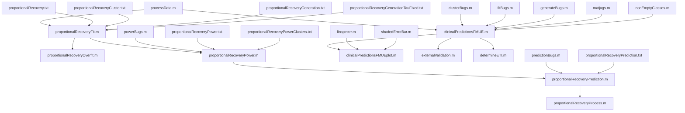

```mermaid
graph TD
    processData[processData.m] --> proportionalRecoveryFit[proportionalRecoveryFit.m]
    processData --> clinicalPredictionsFMUE[clinicalPredictionsFMUE.m]
    proportionalRecoveryFit --> proportionalRecoveryOverfit[proportionalRecoveryOverfit.m]
    proportionalRecoveryFit --> proportionalRecoveryPower[proportionalRecoveryPower.m]
    proportionalRecoveryPower --> proportionalRecoveryPrediction[proportionalRecoveryPrediction.m]
    proportionalRecoveryPrediction --> proportionalRecoveryProcess[proportionalRecoveryProcess.m]
    clinicalPredictionsFMUE --> clinicalPredictionsFMUEplot[clinicalPredictionsFMUEplot.m]
    clinicalPredictionsFMUE --> externalValidation[externalValidation.m]
    clinicalPredictionsFMUE --> determineETI[determineETI.m]
    clusterBugs[clusterBugs.m] --> clinicalPredictionsFMUE
    fitBugs[fitBugs.m] --> clinicalPredictionsFMUE
    generateBugs[generateBugs.m] --> clinicalPredictionsFMUE
    linspecer[linspecer.m] --> clinicalPredictionsFMUEplot
    matjags[matjags.m] --> clinicalPredictionsFMUE
    nonEmptyClasses[nonEmptyClasses.m] --> clinicalPredictionsFMUE
    powerBugs[powerBugs.m] --> proportionalRecoveryPower
    predictionBugs[predictionBugs.m] --> proportionalRecoveryPrediction
    shadedErrorBar[shadedErrorBar.m] --> clinicalPredictionsFMUEplot

    proportionalRecoveryTxt[proportionalRecovery.txt] --> proportionalRecoveryFit
    proportionalRecoveryClusterTxt[proportionalRecoveryCluster.txt] --> proportionalRecoveryFit
    proportionalRecoveryGenerationTxt[proportionalRecoveryGeneration.txt] --> proportionalRecoveryFit
    proportionalRecoveryGenerationTauFixedTxt[proportionalRecoveryGenerationTauFixed.txt] --> proportionalRecoveryFit
    proportionalRecoveryPowerTxt[proportionalRecoveryPower.txt] --> proportionalRecoveryPower
    proportionalRecoveryPowerClustersTxt[proportionalRecoveryPowerClusters.txt] --> proportionalRecoveryPower
    proportionalRecoveryPredictionTxt[proportionalRecoveryPrediction.txt] --> proportionalRecoveryPrediction
```
