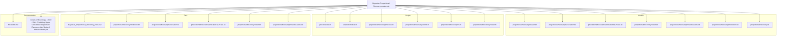

```mermaid
graph TD
  A[Bayesian-Proportional-Recovery-master.zip]
  A1[README.md]
  A2[processData.m]
  A3[proportionalRecoveryCluster.txt]
  A4[proportionalRecoveryGeneration.txt]
  A5[proportionalRecoveryGenerationTauFixed.txt]
  A6[proportionalRecoveryPower.txt]
  A7[proportionalRecoveryPowerClusters.txt]
  A8[proportionalRecoveryPrediction.txt]
  A9[proportionalRecovery.txt]
  A10[shadedErrorBar.m]
  A11[proportionalRecoveryProcess.m]
  A12[proportionalRecoveryOverfit.m]
  A13[proportionalRecoveryFit.m]
  A14[proportionalRecoveryPower.m]
  A15[Bayesian_Proportional_Recovery_Files.csv]
  A16[proportionalRecoveryPrediction.txt]
  A17[proportionalRecoveryGeneration.txt]
  A18[proportionalRecoveryGenerationTauFixed.txt]
  A19[proportionalRecoveryPower.txt]
  A20[proportionalRecoveryPowerClusters.txt]
  A21[Annals of Neurology - 2020 - Vliet - Predicting Upper Limb Motor Impairment Recovery after Stroke A Mixture Model.pdf]

  A --> A1
  A --> A2
  A --> A3
  A --> A4
  A --> A5
  A --> A6
  A --> A7
  A --> A8
  A --> A9
  A --> A10
  A --> A11
  A --> A12
  A --> A13
  A --> A14
  A --> A15
  A --> A16
  A --> A17
  A --> A18
  A --> A19
  A --> A20
  A --> A21

  subgraph Models
    A3
    A4
    A5
    A6
    A7
    A8
    A9
  end

  subgraph Scripts
    A2
    A10
    A11
    A12
    A13
    A14
  end

  subgraph Data
    A15
    A16
    A17
    A18
    A19
    A20
  end

  subgraph Documentation
    A1
    A21
  end


```
