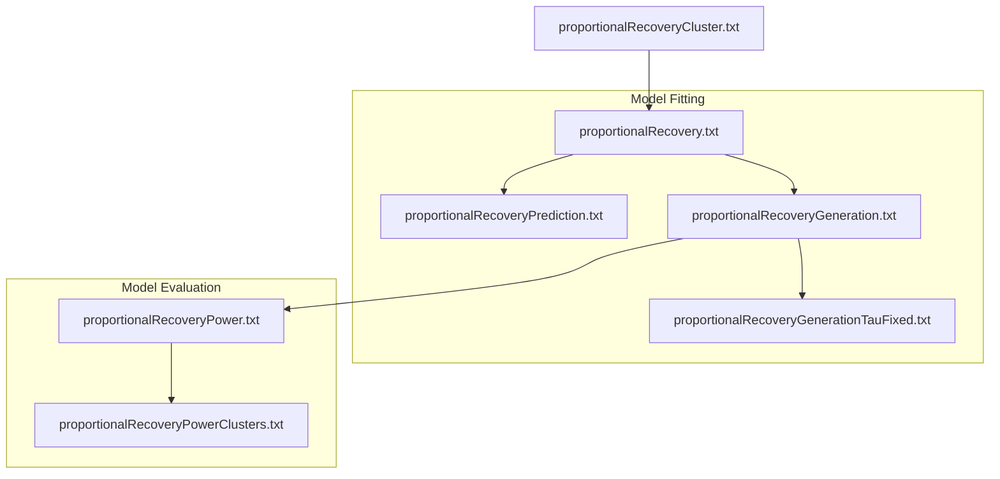

```mermaid
graph TD
  A[proportionalRecoveryCluster.txt] --> B[proportionalRecovery.txt]
  B --> C[proportionalRecoveryPrediction.txt]
  B --> D[proportionalRecoveryGeneration.txt]
  D --> E[proportionalRecoveryGenerationTauFixed.txt]
  D --> F[proportionalRecoveryPower.txt]
  F --> G[proportionalRecoveryPowerClusters.txt]

  subgraph "Model Fitting"
    B
    C
    D
    E
  end

  subgraph "Model Evaluation"
    F
    G
  end

```
